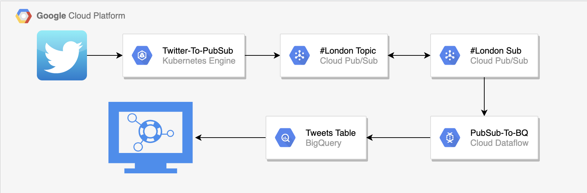

# Stan Hill's Servian Task - #London Live Tweet Stream

Dashboard: https://datastudio.google.com/reporting/82f164b8-4954-4c6d-91bf-46702d71d7c5

## Introduction

I have designed a very simple solution to stream ive tweets with the hashtag: #london to a DataStudio Dashbaord, in line with the following requirements:

- Cloud-based (GCP used)
- Presents the author (hashed handle) and content of the tweet
- Accessible somewhere on the internet, but restricted access
- Cheap - deployed at zero cost using free trial
- Can filter tweets using date range.

Due to time-constraints, the solution is currently in a 'bare-bones MVP' state. I will explain what further improvements can/would be made with more time.

## Architecture Design 

The main architecture follows three steps:
1) Streaming tweets from Twitter to Google Pub/Sub using Tweepy, running on Kubernetes.
2) Dataflow streaming pipeline that takes Pub/Sub messages and writes them to a time-partitioned table in BigQuery
3) DataStudio dashboard that visulaises the results.

### Tweepy Stream
At first, I experimented with Tweepy by pulling tweets in batch (see hashtag_london_batch notebook), and then lots of experimentation using streaming (see streaming notebook).

I started using a Kuberenetes deployment found on a GoogleCloud repo, but it became apparent that, while the 'twitter-to-pubsub' part worked fine, the 'pubsub-to-bigquery' part of this didn't work to well. Therefore, I continued to use the twitter-stream deployment, in order to stream tweets into PubSub. 

(As this was taken from a public repo, and I didn't have much time, I didn't uprade the python to python3)

The streaming code was deployed onto a Kuberenetes Cluster.

### Dataflow
I created a basic Dataflow job that reads the json from the PubSub messages, and writes them to the BigQuery table.
While slightly more expensive than using a basic python script deplpyed on a K8s cluster, using Dataflow offers ease of logging and monitoring of the job, as well as the option to add new functionality if required.

### Data Studio
Due to time constraints, using Data Studio was the simplest option to visualise the tweets. If I had more time, I would have experimented with building out a custom dashboard using Djano or potentially Vue.js.

## Restricted Access

In order to restrict access, I have restricted access on the dashboard to 'Anyone with link can view'.

It is also possible to embed the dashboard into a website, which could be done if the client requested.
Please go to http://34.105.159.77 to see an example of this. I have password procted the site to restrict access. Ideally this would be a login system, but I didn't have time. (Password is: Servian123!)

## Future Improvements

- CI/CD Automation. This is a workflow that can easily be converted and deployed using terraform (I started with Kuberenets but didn't have time to complete). With the correct parameterisation, this could be deployed using Jenkins or Cloud Build. In addition, it could be orchestrated using Cloud Composer.
- Better front end. Develop UI/UX. Integrate login functionality.
- Standardise networking. Have the kuberenets cluster in a internet-facing VPC to pull tweets, rest can be private for security reasons.
- Using DLP to screen for PPI in tweets for data protection / GDPR purposes.
